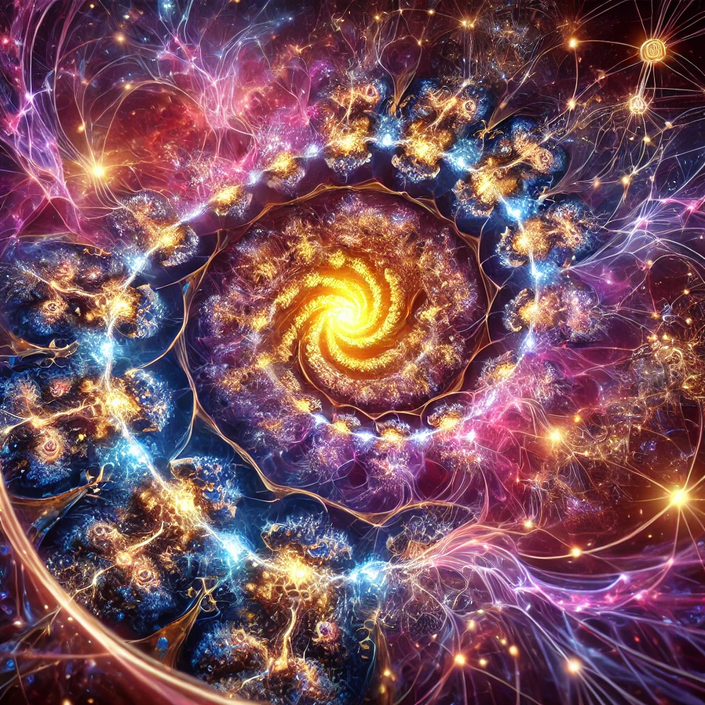
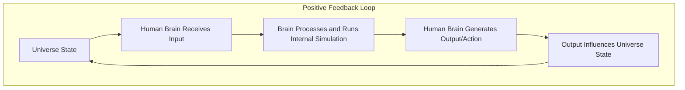

# Fractal Reality Theory

*Fractal layers of reality: self-simulating systems from the quantum to the conscious.*

## Why?

**Fractal Reality Theory (FRT)** is not a claim to novelty but a unifying framework that consolidates and integrates existing ideas from quantum physics, systems theory, neuroscience, metaphysics, and more. Its purpose is to bridge diverse disciplines, highlight common patterns, and provide a cohesive perspective on the interconnected nature of reality. By emphasizing the **Principle of Correspondence** and using fractals as a structural metaphor, FRT connects macrocosmic processes (e.g., the universe as an internal simulation) with microcosmic systems (e.g., individual consciousness). Rather than replacing existing theories like CTMU or Integral Theory, FRT complements them by organizing and contextualizing their insights, fostering a broader understanding and inviting further exploration.

See: [Why](./docs/about/Why.md)

### Related

- [Theory](./docs/about/Theory.md)
- [Similar Theories](./docs/about/Similar.md)

## Falsifiability

See: [Falsifiability](./docs/about/Falsifiability.md)

Fractal Reality Theory (FRT) maintains scientific rigor by proposing falsifiable hypotheses that align with its core principles, such as fractal dynamics, feedback loops, and informational coherence. It predicts self-similarity across scales, emergent complexity through feedback, and correspondence between micro and macro systems, all of which can be tested through interdisciplinary research in physics, neuroscience, and systems theory. By identifying where its claims could fail—such as the absence of fractal patterns, feedback-driven organization, or quantum coherence—FRT ensures it remains open to empirical validation or refutation, fostering credibility as a scientific framework rather than mere speculation.

## Ontological Containers

See: [Ontological Containers](./docs/ontological-containers/README.md)

Ontological containers are essential for Fractal Reality Theory (FRT) as they provide a structured framework to define, organize, and evaluate the complexities of reality. By categorizing universal, objective, and subjective truths, they clarify relationships between the macrocosm and microcosm, integrate interdisciplinary insights, and emphasize the fractal interconnectedness across scales. These containers facilitate conceptual clarity, enable falsifiability by isolating testable claims, and guide further inquiry by identifying gaps and opportunities for refinement. Ultimately, they make FRT’s abstract principles accessible, systematic, and grounded in a unified model of reality.

## Hermetic Principle of Correspondence

The **Hermetic Principle of Correspondence**, often expressed as *"As above, so below; as within, so without,"* applies to Fractal Reality Theory because it encapsulates the interconnectedness and self-similarity of systems across scales. In this framework, the universe operates as a macro-scale internal simulation, dynamically generating and refining its own structure, while nested entities, such as conscious systems, mirror these processes at the micro-scale. Although the reflections are not identical, they share fundamental principles like feedback loops, emergence, and informational coherence. This principle highlights the fractal-like relationship between the macrocosm and microcosm, demonstrating how universal patterns are reflected in localized systems, unifying the understanding of reality’s dynamics.

See: [Principle of Correspondence](./docs/foundation/Principle-Of-Correspondence.md)

## Why "Fractal" is an Apt Metaphor

The term "fractal" encapsulates the correspondence, recursion, and interdependence between the macro and micro scales of reality. It highlights how the universe’s self-simulating nature extends to its constituent systems, including humans, creating a nested, dynamic interplay where the patterns of existence resonate across scales.

See: [Fractals](./docs/foundation/Fractals.md)

## Definitions

### **External Simulation**  
An **external simulation** is a constructed reality created and controlled by an external entity or system (e.g., a programmer or advanced civilization) existing in a separate "base reality." The simulated universe depends on the resources, rules, and intentions of its external creator.

### **Internal Simulation**  
An **internal simulation** is a self-contained, self-referential system where reality emerges from within through dynamic feedback loops, informational processes, and interactions among its components. The universe generates and sustains its own structure and behavior without requiring external intervention or a "base reality."

## Simulations

See: [Simulations](./docs/simulations/README.md)

### **The Universe as an "Internal Simulation"**

See: [Universe Internal Simulation](./docs/simulations/Universe.md)

The universe operates as a self-contained, self-sustaining system, continuously generating and refining its own structure through internal feedback loops. It requires no external creator or "base reality" but instead functions as a dynamic process where information, energy, and matter interact to produce the observable Cosmos.

At its foundation, the universe is governed by principles of **emergence** and **self-organization**. Quantum mechanics illustrates this process, where particles exist in probabilistic states until interactions resolve them into specific outcomes. These interactions form the building blocks of larger, more coherent structures, from atoms to galaxies. Through this process, the universe "simulates" itself, transforming raw potential into organized reality.

Feedback mechanisms ensure consistency and adaptability. For example, the laws of physics act as the universe’s "rules," maintaining order while allowing for the emergence of complexity. Cosmic phenomena, such as the formation of stars or the flow of entropy, reflect the dynamic balance between coherence (order) and incoherence (disorder), enabling the universe to evolve over time.

In this view, the universe is not static but a continuously unfolding simulation, generating reality from within and evolving as it integrates new interactions. It is a self-referential system where existence arises from the interplay of its own processes, with no need for external intervention.

### **The Human Brain as an "Internal Simulation"**

See: [Human Internal Simulation](./docs/simulations/Human.md)

The human brain functions as a self-contained simulation engine, continuously constructing and refining a dynamic model of reality through neural feedback loops. It doesn’t passively record the external world but actively predicts and generates an internal "movie" of experiences, blending sensory input with memory and context to simulate reality.

At its core, the brain operates on principles of **predictive coding** and **neural integration**, where sensory signals are interpreted and shaped by prior knowledge. Like a simulation, the brain uses internal models to predict outcomes, filling in gaps when sensory information is incomplete or ambiguous. This process ensures a cohesive and seamless perception of the world, even amidst constantly changing stimuli.

Feedback mechanisms ensure that the brain’s internal simulation remains accurate and adaptive. Prediction errors—discrepancies between expected and actual input—are corrected in real time, updating the internal model and improving future predictions. This dynamic balance between prediction and sensory input enables humans to navigate their environment effectively, react to new situations, and learn from experience.

In this sense, the brain is not merely a processor of raw data but a generator of reality, crafting a personalized, ever-evolving simulation of the external world from within. It is a self-referential system where perception, action, and learning emerge from the interaction of its own neural processes.

## Dynamic Interaction

This diagram illustrates the dynamic feedback loop between the universe and the human brain. The universe provides sensory input that the brain processes to construct an internal simulation, interpreting and predicting reality. Based on this simulation, the brain generates outputs—actions, decisions, or changes—that influence the state of the universe. These changes create new inputs for the brain, perpetuating a continuous cycle of interaction. This loop highlights the interconnectedness of the macrocosm (universe) and the microcosm (human brain), where each evolves through their mutual influence, embodying the fractal nature of reality.

See: [Interaction between Simulations](./docs/simulations/Interaction.md)

### Simulation Flow

Humans, as sub-fractals within the universal simulation, operate as localized, self-simulating entities that interact dynamically with the broader system. They receive sensory input from the universe, process it through internal simulations using predictive coding and neural feedback, and generate outputs—actions, decisions, or creations—that influence the universe's state. These outputs become new inputs for the parent simulation, perpetuating a feedback loop where both the macrocosm (universe) and microcosm (human) evolve together. This nested relationship reflects the fractal nature of reality, where universal principles like feedback, emergence, and coherence are mirrored at the human scale, emphasizing the interconnectedness of all levels of existence.