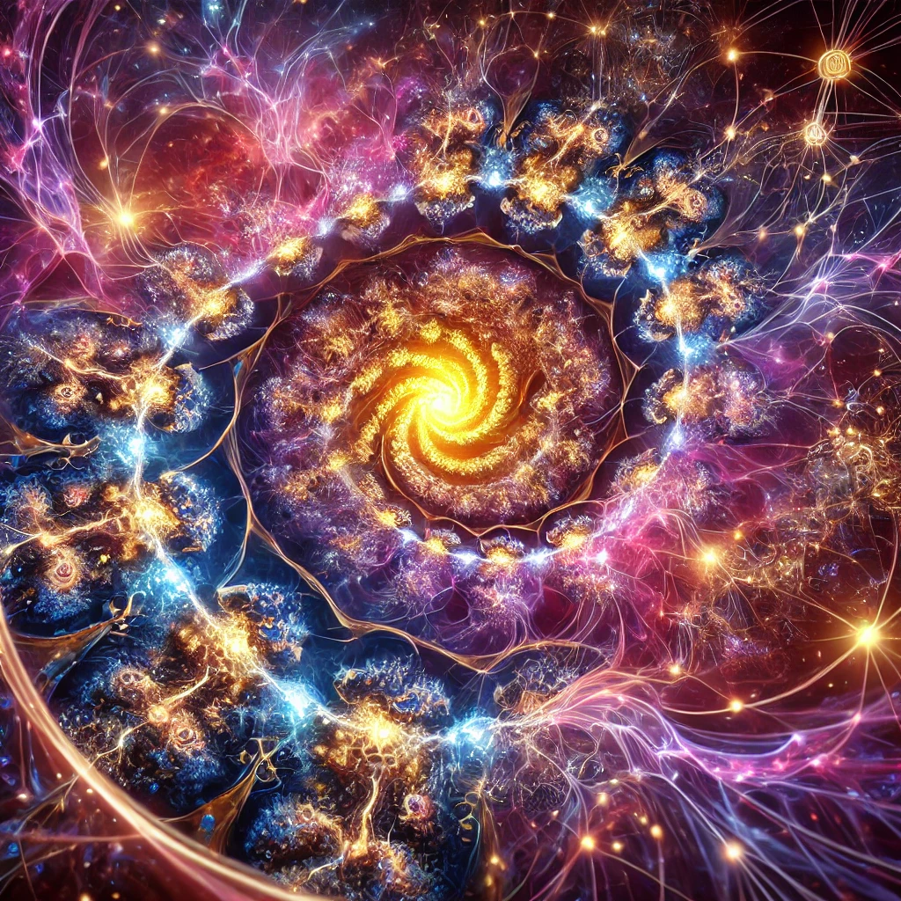

# Fractals

## Definition

A curve or geometric figure, each part of which has the same statistical character as the whole. Fractals are useful in modeling structures (such as eroded coastlines or snowflakes) in which similar patterns recur at progressively smaller scales, and in describing partly random or chaotic phenomena such as crystal growth, fluid turbulence, and galaxy formation.

## Visual Example

## Description

The term **"Fractal"** applies to the Fractal Reality Theory because it captures the idea of **self-similarity** and **nested patterns** across different scales, which are central to both the universe as an internal simulation and human perception as a microcosmic counterpart.

## Key Connections of "Fractal" to the Theory

1. **Self-Similarity Across Scales**:
   - In fractals, patterns repeat across different levels of magnification, maintaining structural resemblance regardless of scale.
   - In the theory:
     - The **macrocosm** (the universe) and the **microcosm** (human internal simulation) mirror each other conceptually.
     - Both operate as self-sustaining systems using feedback loops, informational processing, and emergent complexity, though they are not exact replicas.

2. **Dynamic Interplay**:
   - Fractals are not static; they often emerge through iterative processes or recursive algorithms, creating patterns that evolve over time.
   - Similarly, the universe and human simulations involve dynamic feedback loops, where:
     - The universe evolves through interactions between its fundamental elements (e.g., quantum processes).
     - Humans dynamically construct their perception of reality by updating internal models with new sensory and experiential data.

3. **Imperfect Correspondence**:
   - While fractals exhibit self-similarity, each layer or iteration can introduce slight variations, maintaining the essence of the structure without exact duplication.
   - In the theory:
     - The universe and human consciousness do not produce 1:1 reflections of one another.
     - Humans simulate their reality through subjective models, which are localized and imperfect interpretations of the universal processes.

4. **Nested Systems**:
   - Fractals often feature **nested hierarchies**, where smaller patterns are embedded within larger ones.
   - The Fractal Reality Theory posits a similar nesting:
     - The universe is the "larger" self-simulating system, while individual conscious entities are "smaller" self-simulating systems nested within the universal framework.

5. **Emergent Complexity**:
   - Fractals demonstrate how simple iterative rules can generate highly complex, intricate structures, often resembling natural systems (e.g., coastlines, tree branches, or galaxies).
   - In the theory:
     - The universe's complexity emerges from foundational principles (e.g., quantum mechanics, feedback loops).
     - Human cognition and perception similarly arise from simple neurological processes that create intricate mental models.