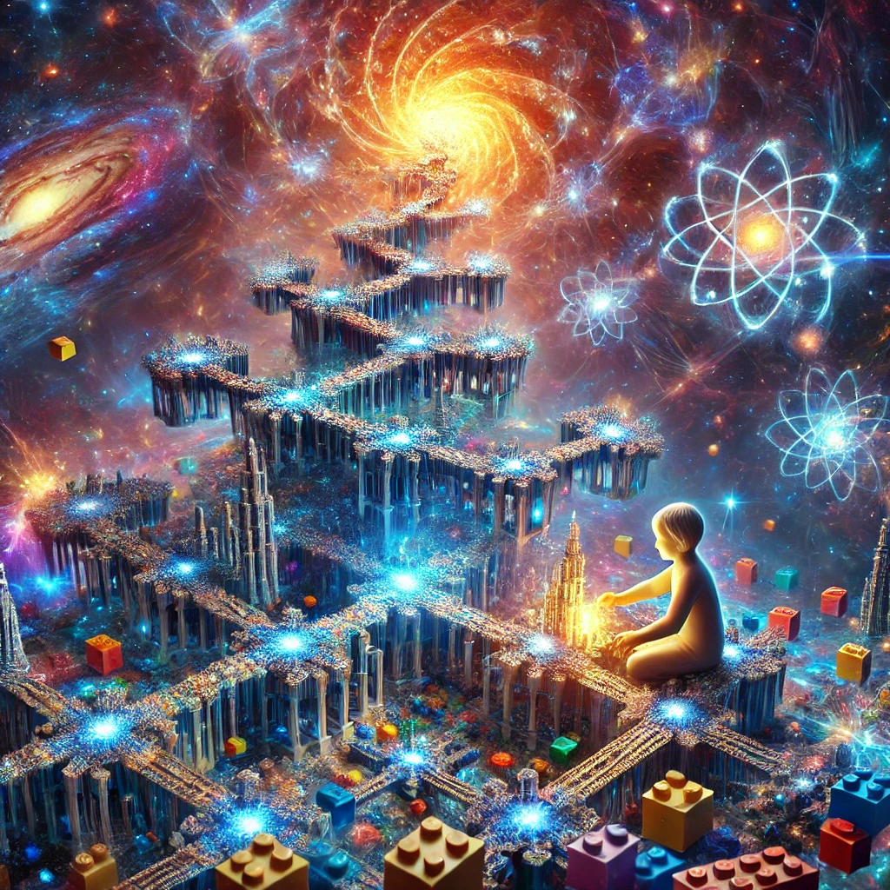

### **Mental Model: Understanding Fractal Reality Theory (FRT) for a 10-Year-Old**

#### **Core Idea: The Universe is Like a Never-Ending LEGO Set**

Imagine you have a magical LEGO set. This LEGO set is super special because:

1. **It builds itself.**
2. **Each piece of LEGO looks like a tiny version of the whole set.**
3. **Every time you add a piece, the whole LEGO set changes and grows.**

Fractal Reality Theory (FRT) is a way to think about how the universe works, just like this magical LEGO set.

---

### **1. The Universe Builds Itself**
- **The Big Idea**: The universe doesn’t need anyone to make it—it builds itself over and over again, like a LEGO tower that keeps adding bricks by itself.  
- **How It Works**: Simple rules (like “always stack bricks a certain way”) help the universe create everything, from stars to trees to you!

---

### **2. Everything Looks Like the Whole Thing**
- **The Big Idea**: Every part of the universe is like a tiny copy of the bigger universe.  
- **Example**: A tree has big branches, smaller branches, and tiny twigs—all of them look similar! The universe is like that too, with big galaxies, smaller planets, and even tinier atoms.

---

### **3. Your Brain Builds a LEGO World Inside**
- **The Big Idea**: Your brain is like its own LEGO builder, making a little model of the world inside your head.  
- **Example**: When you see a cat, your brain builds a mini picture of the cat so you know it’s fluffy and nice to pet. But your brain’s picture of the cat isn’t the real cat—it’s your brain’s LEGO version!

---

### **4. The Universe and Your Brain Work Together**
- **The Big Idea**: The universe talks to your brain, and your brain talks back to the universe.  
- **Example**: If you see a messy LEGO pile (the universe), you might decide to tidy it up. Now the LEGO pile is neat because of what your brain decided! You and the universe keep working together to change things.

---

### **5. The Universe Likes Patterns**
- **The Big Idea**: The universe builds things in patterns, like repeating LEGO designs, because it makes everything fit together nicely.  
- **Example**: Snowflakes, seashells, and galaxies all have cool patterns, just like building blocks that snap together perfectly.

---

### **6. Everything is Connected**
- **The Big Idea**: All the LEGO pieces in the universe are connected. If you change one piece, it can change the whole thing.  
- **Example**: If you take one brick out of a LEGO tower, it might wobble or even fall. The same happens in the universe—small changes can affect big things!

---

### **Why It’s Cool**
FRT tells us that the universe isn’t just random—it’s like a magical LEGO set with patterns, connections, and tiny versions of itself everywhere. You’re part of the LEGO set too, building your own little world and helping the big universe grow and change!