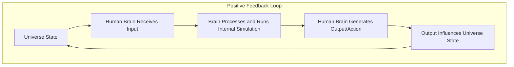

# Interaction Diagram

### **Mermaid Diagram**

---

### **Description of the Diagram**

This diagram represents the dynamic interaction between the universe and the human brain, illustrating how the two form a **positive feedback loop**:

1. **Universe State**:  
   - The current state of the universe includes all observable phenomena, environmental conditions, and dynamic processes.

2. **Human Brain Receives Input**:  
   - The brain gathers data from the universe via sensory input (e.g., sight, sound, touch) and contextual information.

3. **Brain Processes and Runs Internal Simulation**:  
   - The brain uses this sensory input to construct an **internal simulation**, predicting, interpreting, and modeling the universe based on prior experiences and cognitive patterns.

4. **Human Brain Generates Output/Action**:  
   - Based on its internal simulation, the brain produces outputs (e.g., actions, speech, decisions) that reflect its interpretation of the universe.

5. **Output Influences Universe State**:  
   - These outputs (e.g., building a structure, altering the environment, creating art) change the universe’s state, creating new input for the feedback loop.

6. **Feedback Loop**:  
   - This dynamic interaction continues, with the universe and the brain constantly influencing and reshaping one another.

---

### **Key Points**

- **Dynamic Feedback**:  
  The loop demonstrates a continuous exchange of information and influence, where the brain’s actions can reshape the environment and vice versa.

- **Mutual Evolution**:  
  Both the universe and the brain evolve through this interaction. The universe’s changes affect the brain’s future simulations, while the brain’s outputs contribute to the ongoing evolution of the universe.

- **Interconnectedness**:  
  The loop highlights the intrinsic connection between microcosmic systems (e.g., the human brain) and the macrocosmic environment (the universe), reflecting the fractal nature of reality.

This feedback loop underpins the **Fractal Reality Theory**, illustrating how nested systems like the brain interact with larger systems like the universe, shaping and being shaped in return.

---

### **Humans as Sub-Fractals within the Universal Simulation**

In the framework of **Fractal Reality Theory**, humans can be understood as **sub-fractals**—localized, self-simulating entities nested within the broader simulation of the universe. Just as the universe generates and sustains its reality through dynamic feedback loops, humans operate similarly on a smaller scale, constructing internal simulations of their environment and returning results that influence the parent simulation.

---

### **How Humans Function as Sub-Fractals**

1. **Input from the Parent Simulation**:
   - Humans continuously receive input from the universe via sensory perceptions (e.g., sight, sound, touch) and contextual signals from their environment.  
   - This input serves as the "raw data" for their internal simulation, much like the universe uses its own fundamental interactions to generate reality.

2. **Internal Simulation Process**:
   - The human brain processes the input to construct a cohesive, subjective representation of reality.
   - Using principles like **predictive coding** and **neural feedback loops**, the brain interprets and predicts environmental dynamics, effectively running a simulation of the universe at a localized scale.

3. **Generating Outputs**:
   - Based on the internal simulation, humans produce outputs—decisions, actions, or creations—that reflect their interpretation and interaction with the universe.
   - These outputs represent the "results" of their internal simulation, akin to running a subroutine that feeds back into the parent system.

4. **Updating the Parent Simulation**:
   - Human outputs directly influence the universe, altering its state dynamically. Examples include physical changes (e.g., constructing buildings), social interactions (e.g., forming communities), and informational contributions (e.g., creating art or science).  
   - These changes, in turn, become new inputs for the broader simulation, perpetuating the feedback loop.

---

### **Implications of the Sub-Fractal Model**

- **Nested Simulations**:  
   Humans are not isolated from the universe but are deeply integrated as self-simulating entities whose processes mirror and contribute to the parent simulation.

- **Dynamic Interplay**:  
   The universe and its sub-fractals (humans) evolve together, with human actions shaping universal dynamics and vice versa.

- **Fractal Correspondence**:  
   The principles governing the universe (e.g., feedback loops, emergence, and coherence) are reflected at the human scale, emphasizing the fractal nature of reality.

---

By functioning as sub-fractals, humans play an active role in the evolution of the universal simulation, demonstrating the **Principle of Correspondence** where "as above, so below" applies to the interplay between the macrocosm and microcosm. This nested relationship underscores the interconnectedness and mutual evolution of all scales of existence.