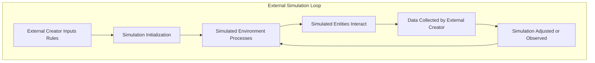
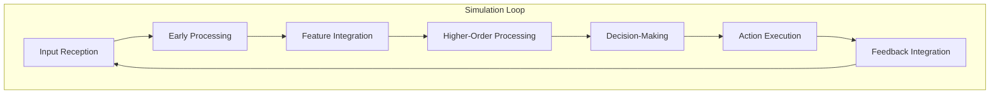

# Simulations

## External Simulation

An **external simulation** is a constructed reality created and controlled by an external entity or system (e.g., a programmer or advanced civilization) existing in a separate "base reality." The simulated universe depends on the resources, rules, and intentions of its external creator.

### Description of the Loop

1. **External Creator Inputs Rules**:  
   The simulation's parameters, rules, and foundational logic are defined by an external creator (e.g., programmers or higher entities).  

2. **Simulation Initialization**:  
   The external simulation begins, generating the environment and entities within the defined parameters.  

3. **Simulated Environment Processes**:  
   The system operates under its internal rules, with simulated entities and events emerging based on the initial setup.  

4. **Simulated Entities Interact**:  
   Entities within the simulation interact with each other and their environment, producing dynamic outcomes.  

5. **Data Collected by External Creator**:  
   The external creator observes or collects data on the simulation's processes, events, or outputs.  

6. **Simulation Adjusted or Observed**:  
   The external creator either passively observes the simulation or intervenes to adjust parameters, restarting the loop of interactions and evolution.  

This external loop highlights the dependency on an **outside agent** to define and sustain the simulation, unlike the **Internal Simulation Loop**, which is self-contained and self-referential. Let me know if you'd like refinements or additional comparisons!

## Internal Simulation
An **internal simulation** is a self-contained, self-referential system where reality emerges from within through dynamic feedback loops, informational processes, and interactions among its components. The universe generates and sustains its own structure and behavior without requiring external intervention or a "base reality."

### Diagram

### Description of the Loop

1. **Input Reception**: The system gathers raw data from its environment or internal state.  
2. **Early Processing**: Input is decomposed into basic features or foundational components.  
3. **Feature Integration**: Multiple data streams are integrated into a coherent model.  
4. **Higher-Order Processing**: Meaning is assigned, predictions are refined, and the simulation becomes contextually aware.  
5. **Decision-Making**: Possible actions are evaluated, and a response is chosen based on goals and outcomes.  
6. **Action Execution**: The chosen response is enacted, producing external or internal changes.  
7. **Feedback Integration**: Results from the action are compared to predictions, updating the simulation model to improve future iterations.  

This loop ensures continuous refinement and adaptation of the internal simulation. Let me know if you need this extended or customized further!